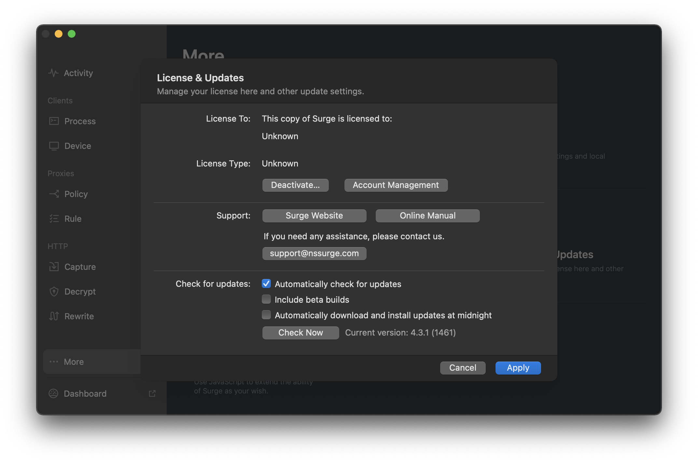

## [Surge v4](https://dl.nssurge.com/mac/v4/Surge-4.3.1-1461-829471a307259fe1729cf06a7cd13d06.zip) full crack.

**FOR STUDY PURPOSES ONLY.**

敏感信息已模糊处理

### 基本类型

license type：

- 1: Trial
- 2: Licensed
- 3: Revoked

### 过反调试

程序开头使用ptrace反调试，可以静态/动态patch过掉，参见

https://cardaci.xyz/blog/2018/02/12/a-macos-anti-debug-technique-using-ptrace/

### 伪造license

license在`~/Library/Application\ Support/com.nssurge.surge-mac/`的xattr中，被签过名。

- [x] 在0x000000000处，将1改为2（licensed），该函数用于判定license类型并赋值给一个license type的全局变量（0x000000000）
- [x] 0x000000000处的函数验证了license的签名，patch该函数可以过掉签名验证，然后license随便写
- [ ] 验证签名使用EVP算法，尝试劫持本地公钥，伪造license和签名

### 应用重签名

应用有签名，使用

```
codesign -s - -fv path
```

重新Ad-Hoc签名后应用联网出现问题，控制变量进行实验发现只要重签名就出问题，因此推测程序内存在某种检查。使用dtrace检查syscall，发现程序执行过程中读到了自己的embedded code signature，因此使用dtrace监控stacktrace：

```D
#!/usr/sbin/dtrace -s

syscall::pread:entry
/ pid == $1 && arg3 == 0x000000000 /
{
    ustack(50);
}
```

结合结果进行检查发现函数0x000000000调用了和codesign有关的函数，提取了当前应用的codesign信息中的teamID（Surge公司的ID为XXXXXXXX），并求出各位的和：

```python
sum(map(lambda x: ord(x), "XXXXXXXX"))
```

在0x000000000的函数中，这个和被用于计算出某个关键网络地址，重新签名后patch上述函数，应用成功联网。

### 来自helper的二次验证

上述步骤完成后发现Surge主程序不定时闪退，调试发现收到SIGKILL，使用dtrace监控：

```D
#!/usr/sbin/dtrace -s

syscall::kill:entry
/ (args[0] == $1 && args[1] == 9) /
{
    printf("[%s - %d - %d] sent SIGKILL\n",
           execname, pid, tid);
}
```

发现信号来自helper，因此分析helper发现有检查：

1. patch一下，将SecCode检查过掉
2. 对helper进行重签名，注意先使用lipo将help strip成单一架构的binary，否则codesign重签名后验证依然不通过（因为只签了当前架构的）
3. 修改helper和主程序的Info.plist的`SMPrivilegedExecutables`域并重签名，直至使用 https://raw.githubusercontent.com/keybase/client/master/osx/Helper/SMJobBlessUtil.py 校验通过。

破解结果如下，程序稳定运行：


